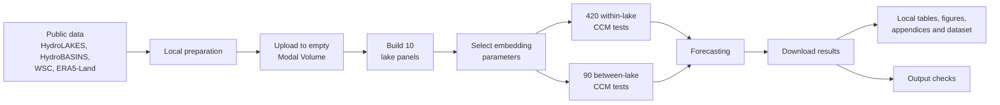

# Technical Appendix: Reproduction Protocol

## 1. Scope

This appendix documents the single route used to reproduce the reported
analysis for *Causal Exploration and Predictability of Lake Water Level:
Evidence from Two Regulated Canadian River Basins*. The study covers ten lakes
at monthly resolution from January 1994 to December 2024. Data assembly, CCM
and forecasting run on Modal; source preparation and output rendering are
local. Exploratory and superseded code paths are not included.

## 2. Workflow

**Figure TA.1.** The official reproduction route. Stages from panel building
through forecasting run on Modal.

## 3. Data

| Source | Exact product or access route | Use |
| --- | --- | --- |
| HydroLAKES | [`HydroLAKES_polys_v10_shp.zip`](https://data.hydrosheds.org/file/hydrolakes/HydroLAKES_polys_v10_shp.zip) | Lake polygons; temperature and evaporation masks |
| HydroBASINS | [`hybas_na_lev12_v1c.zip`](https://data.hydrosheds.org/file/hydrobasins/standard/hybas_na_lev12_v1c.zip) | Upstream masks for precipitation, runoff and snow water equivalent |
| WSC | [Monthly hydrometric service](https://wateroffice.ec.gc.ca/services/monthly_data/csv/inline) | Monthly water level and regulated discharge |
| ERA5-Land | [Monthly averaged reanalysis](https://cds.climate.copernicus.eu/datasets/reanalysis-era5-land-monthly-means) through the CDS API | Temperature, precipitation, runoff, snow water equivalent and evaporation |

The fixed sample comprises Kalamalka, Okanagan, Skaha, Vaseux, Rainy, Lake of
the Woods, Playgreen, Kiskitto, Sipiwesk and Split lakes. Station assignments
and data coverage are reported in
`reference/appendices/A1_lakes_and_stations.csv` and
`reference/appendices/B2_data_availability.csv`. Reproduction does not repeat
candidate-lake screening.

## 4. Methods and fixed settings

| Component | Procedure and settings |
| --- | --- |
| Panel construction | Spatial means over 0.1° ERA5-Land cells. Lake masks are used for temperature and evaporation; upstream-basin masks for precipitation, runoff and snow water equivalent. |
| Preprocessing | Multi-gauge water levels are centred and combined. Confirmed outliers are set to missing using robust change and level thresholds of 6 and 5. Monthly climatology is estimated from training data only and removed. Gaps of at most six months may be filled during modelling. |
| Embedding | Univariate Simplex selection with `tau = 1`, candidate `E = 2,…,10`, and at least 30 observations. |
| CCM | Signed lags `-12,…,12`; 500 IAAFT surrogates; convergence diagnostic; Benjamini–Hochberg FDR at `alpha = 0.05`; fixed seeds. The design contains 420 within-lake and 90 between-lake directed tests. |
| Forecast design | Final 37 months held out; rolling horizons 1, 3, 6 and 12 months. Forecast lags are restricted to 1–12 months. |
| Models | Persistence, seasonal ARIMA/SARIMAX (`m = 12`) and XGBoost. Predictor sets comprise all variables, AIC stepwise selection, direct CCM causes, CCM ancestors and connected-lake neighbours. |
| XGBoost | One global configuration selected from six candidates using three expanding-window folds per lake; `subsample = 0.8`, `colsample_bytree = 0.8`, `random_state = 0`. |
| Evaluation | RMSE, MAE, NSE, PBIAS and squared-error Diebold–Mariano tests with BH-FDR. |

The shared implementation is
`code/01_analysis_core/analysis_core.py`; it is called by the Modal entry
points and is not a separate local analysis route.

## 5. Execution

Run from the repository root. The exact setup, upload and download commands are
listed in `MODAL_REPRODUCTION.md`.

| Order | Location | Command or entry point | Output |
| ---: | --- | --- | --- |
| 1 | Local/Modal | Prepare the two shapefiles; create empty `ccm-data`; upload them and create `cds-api` | Source inputs |
| 2 | Modal | `modal_build_lake_panels.py::fetch_only`, then `::process_only` | Ten lake panel files |
| 3 | Modal | `modal_compute_embedding_params.py` | Embedding JSON |
| 4 | Modal | `modal_within_lake_ccm.py`; merge after 420 valid shards | Within-lake CCM CSV |
| 5 | Modal | `modal_inter_lake_ccm.py`; merge after 90 valid shards | Between-lake CCM CSVs |
| 6 | Modal | `modal_forecast_synchrony_filtered.py::detached` | Forecast and tuning CSVs |
| 7 | Local | Download Modal outputs and run `python code/05_postprocess_local/build_outputs.py` | Tables, figures, appendices and dataset |
| 8 | Local | `python code/99_check_outputs/check_modal_outputs.py` | Reproduction checks |

A new empty Modal Volume is required because existing shard names do not encode
every code and parameter change.

## 6. Software

| Stage | Environment |
| --- | --- |
| Local post-processing | Python 3.11; `requirements.txt` |
| Modal data and CCM | Python 3.11; `pandas==2.2.2`, `numpy==1.26.4`, `pyEDM==2.4.0` |
| Modal forecasting | Python 3.12; the same core versions plus `xgboost==3.4.1`, `pmdarima`, `statsmodels` and `networkx` |

The original run did not preserve exact `pmdarima` and `statsmodels`
versions; SARIMA/SARIMAX results may therefore not be byte-identical after
future image rebuilds.

## 7. Verification

| Output | Check |
| --- | ---: |
| Lake panels and embedding JSON | 10 lakes |
| Within-lake CCM | 420 rows |
| Between-lake CCM | 90 rows |
| Forecast full / rolling / DM / selected-lag outputs | 122 / 372 / 341 / 38 rows in the original run |
| XGBoost tuning | 6 candidates; one selected; 10 lakes and 30 folds in the original run |

The 420 and 90 counts are fixed by the experimental design. Forecast counts may
change if live WSC or ERA5-Land data are revised. The committed `reference/`
directory records the analysis reported in the dissertation and should not be
overwritten merely because a later retrieval differs. Any difference should be
documented; reference outputs should change only if the dissertation results
and all dependent tables and figures are updated together.
